#第7章 移动学习的发展趋势和未来
	这一章，我们将介绍移动计算领域最近出现的一些新技术，这些技术应用到移动学习领域将进一步增强移动设备的能力，拓展移动学习的领域，使得原来想象中的或是科幻片中才能看到的学习场景和学习体验成为现实。了解这些技术将有利于我们掌握技术发展和应用的脉络，构思移动学习的方案。因此我们首先会介绍3-5年内会普及的移动学习技术，然后对5年后有可能应用的未来技术作一个大胆预测，最后再讨论由于新技术的采用，学习的范式会发生什么样的改变。

##7.1 移动学习会变得更加高效和经济
在此，我们将会向大家介绍一些已经初露苗头或开始流行，在不久的将来将会成熟和广泛应用的移动学习技术。这些技术在3-5年内或是更早将会成为市场上采用的主流技术，对移动学习的发展有着重要的影响。

###电子书和电子纸
电子书又称为electronic book、digital book、e-book。简单的说，电子书是按照一定的技术规范和格式将数字化内容（包括文字、图片、影音和交互程序）的集合，可透过网络或者其它载体下载至一般常见的平台，例如：个人计算机 、笔记型计算机、平板电脑、电视、手机等设备阅读，或是kindle等专用的阅读器上阅读的，它是一种传统纸质图书的替代品。

最近几年，电子书的技术和市场已经基本成熟。美国最大的图书销售商亚马逊自2011年5月起电子书销售量就已经超过其纸质书销售，亚马逊每卖出100本纸质书就会卖出105本电子书，Kindle电子书的销量是以往同期的3倍；其新推出的低价版本、带有广告的Kindle阅读器销售量也超过了其他版本设备。

便携设备中除了手机和平板电脑可用于阅读电子书以外，采用电子纸(e-ink)技术的电子书阅读器也广为流行，这种技术具有耗电量低（电子纸换页时才耗电），而且如同普通纸张采取被动反光显示，可获得近似纸质书籍的阅读体验。目前，彩色显示技术和可折叠的柔性电子纸也在研发中，不久的将来会投放市场。

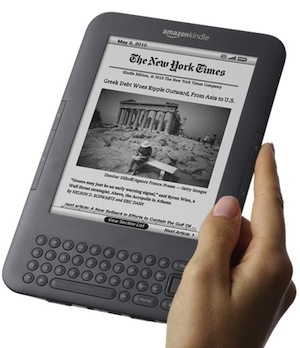 
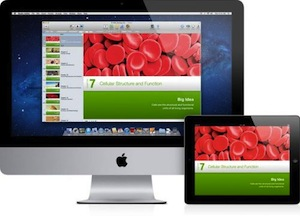  

与纸质书的比较，电子书的优点在于：制作方便，无印刷和发行成本；存储能力强大，方便携带；文字大小颜色可以调节，可以使用外置的语音软件进行朗诵，方便有阅读障碍的人士使用。此外，电子书还有以下的几个优势

* **无纸化：** 电子书不再依赖于纸张，以磁性储存介质取而代之。得益于磁性介质储存的高性能，一张700MB的光盘可以代替传统的三亿字的纸质图书。这大大减少了木材的消耗 和空间的占用。
* **多媒体：** 电子书一般都不仅仅是纯文字，而添加有许多多媒体元素，诸如图像、声音、影像。在一定程度上丰富了知识的载体。
* **交互性：** 一些类型的电子书有较好的
* **丰富性：** 由于互联网快速发展，致使传统知识电子化加快，现在基本上除了比较专业的古代典籍，大部分传统书籍都搬上了互联网，这使电子书读者有近乎无限的知识来源，原来因为成本原因无法出版和传播的小众书籍也可以出版，丰富了图书市场的长尾。

电子书和电子出版对移动学习的影响

* 电子书是移动学习中学习内容的传播途径之一，涉及到移动学习中学习内容的包装、交换和发布等环节。电子书可直接用于传递学习内容，也可和其它学习工具结合起来使用。
* 电子书的形态让学习环境能够移动起来，对移动学习环境建设具有重要影响。电子书可作为最简单的移动学习解决方案，甚至不需要专门的开发就可以实现学习内容的移动化。
* 交互式电子书通过多媒体、用户和内容之间的互动大大丰富了学习者的体验。可图文并茂并结合声音，动画，给读者带来更多乐趣，比如，当读者在触摸某本儿童书籍的时候，里边的小鸟可以动起来，飞向天空，还能发出叽叽喳喳的鸣叫声。
* 电子书阅读器可用于构建移动学习的装备环境，国外的一些大学Kindle正在用kindle和iPad作为载体，配合电子书取代传统的课本。
* 电子书降低了移动学习内容制作的难度，iAutohr等专门的制作工具主要面向作者、出版商和艺术家平台，允许他们在没有任何编程技能的情况下，将他们的图书转化为可应用于iPad和iPhone 的App程序。
* 电子书改变了学习内容的出版和发布的生态圈，一些超前的出版社和图书馆逐步以电子资源取代传统的纸质书，以电子书的形式提供教科书租借、图书馆借阅服务。

当然，电子书在传播和使用的过程中，仍旧面临不少问题。例如，电子书容易被非法复制，损害原作者利益；长期注视电子屏幕有害视力；不同平台和阅读器之间的格式存在不兼容的问题。从教学模式上来看，电子书本身缺乏反馈和人际互动的渠道，因此必须和其它方式配合使用才能取得较好的效果。

###平板电脑
平板电脑最早由微软公司总裁比尔•盖茨在2002年提出，他认为平板电脑（Tablet PC）是一种无须翻盖、没有键盘、小到放入女士手袋，但却功能完整的PC。而苹果公司在2010年发布的iPad则重新定义了平板电脑的概念和设计思想，将其界定为手机和桌面电脑之间的便携移动设备。此后，各大厂商纷纷推出大量类似产品。我们在本文中所讨论的平板电脑就是此类轻薄便携，具有独立的操作系统和网络功能，以触摸屏为基本输入的设备。

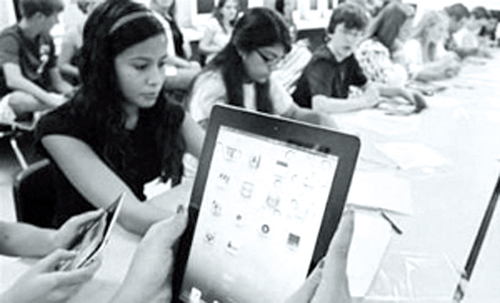 

平板电脑作为一种新媒体，其尺寸和便携性介于智能手机和笔记本电脑之间，因此，既有兼有两者的一些共性，又在某些方面表现出其独有的特性。目前，由于市场中平板阵营不断扩充，对于平板电脑的产品界定并没有特定标准。但是，行业内对于平板电脑有一些基本的共识，其特点包括：

* 具有一定的便携性。大多数平板电脑的屏幕尺寸在7到10英寸之间，重量一般在400到700克左右。方便学生随身携带，能够随时随地进行学习，并能取得比手机更好的学习体验。
* 主要采用触屏输入的方式。和触屏手机一样，以点击、滑动等更直观的手势方式进行操作。有些平板还配有电磁感应笔，以满足精确作图的需要。
* 配备多种传感器用于输入信息。平板电脑配备了声、光、重力、加速度、位置等多种传感器。这些传感器不仅能为操作系统本身服务，也可以在应用程序中调用，赋予程序一定的智能。
* 具有强大的网络功能。各类主流平板电脑均可以Wi-Fi的方式连接到互联网，有些还配备了3G和4G网络功能。用户可以以较高的带宽浏览网页、观看在线视频、下载文件等。
* 具有独立的操作系统。可按需安装第三方软件或自行开发应用程序。并构建了软件开发、发布、应用、盈利的生态圈。通过安装更多的应用程序，将功能无限扩展，使得平板电脑用户得到更个性化的服务。

学生拿着iPad这样的平板电脑，可在教室或学校任何角落“移动学习”，甚至取代课本成为教材。美国加州等四个学区也正式展开电子课堂试点，八年级代数教科书将被iPad平板电脑替代，未来该项目可能会扩大到其他地点；澳大利亚一所大学也将用iPad代替纸质教科书，供部分学生免费学习。北京和上海等国内发达地区的中小学也开始试点基于平板电脑的“电子课堂”。iPad等平板电脑会取代传统的纸质课本成为新一代教科书，随之我们的的学习方式也将发生相应的改变。

###云计算
云计算（cloud computing）是一种基于因特网的超级计算模式，在远程的数据中心里，成千上万台电脑和服务器连接成一片超级电脑集群，用户通过电脑、笔记本、手机等方式接入数据中心，按自己的需求进行运算。云是网络、互联网的一种比喻说法。过去在图中往往用云来表示电信网，后来也用来表示互联网和底层基础设施的抽象。

云计算通过互联网和内联网使计算分布在大量的分布式计算机上，而非本地计算机或远程服务器中，企业数据中心的运行将与互联网更相似。这使得企业能够将资源切换到需要的应用上，根据需求访问计算机和存储系统。好比是从古老的单台发电机模式转向了电厂集中供电的模式。它意味着计算能力也可以作为一种商品进行流通，就像煤气、水电一样，取用方便，费用低廉。最大的不同在于，它是通过互联网进行传输的。

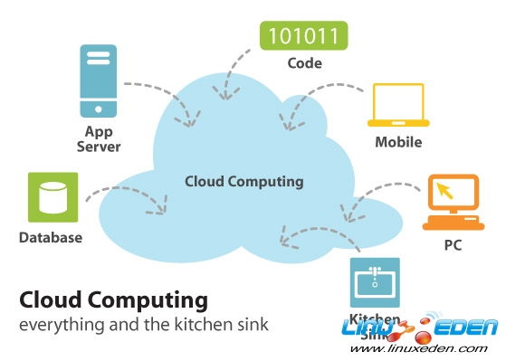 

那么，云计算有哪些特点和优势？　　　　　　

* 安全。云计算提供了最可靠、最安全的数据存储中心，用户不用再担心数据丢失、病毒入侵等麻烦。
* 方便。它对用户端的设备要求最低，使用起来很方便。
* 共享。它可以轻松实现不同设备间的数据与应用共享。
* 可扩展。经由在合理粒度上按需的服务开通资源，接近实时的自服务，无需用户对峰值负载进行工程构造。
* 易维护。云计算应用是很简单的，因为显而易见用户无需再在本机上进行安装。一旦改变达到了客户端，它们将更容易支持以及改进。

云计算对移动学习的影响

* **有利于改变现有的移动学习模式**。云计算使得学习泛在化得以更好的实现，学习内容和学习处理的过程可以存储在远端，通过方便、随时获得网络接入调用和共享。
* **对移动学习设备要求大幅降低**。以往由于设备计算能力和网络带宽限制不能提供的应用和服务，现在可以大量的计算放在云端，调用最快的通讯线路。
* **整合最丰富的教育信息资源**。互联网最大的优势在于资源的聚合，云计算根本出发点就是信息的融合、存储并通过网络服务进行共享，这使得教育者可以最大限度的整合教育资源。

云计算技术大大扩展了移动学习的应用场景和表现能力，使得学习更加泛在化，可随时随地在任何设备进行学习。但是，云技术要求大量用户参与，也不可避免的出现了隐私问题。用户参与即要收集某些用户数据，从而引发了用户数据安全的担心。很多用户担心自己的隐私会被云技术收集。

###物联网
物联网（The Internet of things）通过智能感知、识别技术与普适计算、泛在网络的融合应用，被称为继计算机、互联网之后世界信息产业发展的第三次浪潮。物联网的概念是在1999年提出的。即通过射频识别（RFID）、红外感应器、全球定位系统、激光扫描器等信息传感设备，按约定的协议，把任何物品与互联网连接起来，进行信息交换和通讯，以实现智能化识别、定位、跟踪、监控和管理的一种网络。

简而言之，物联网就是“物物相连的互联网”。这一概念有两层含义：第一，物联网的核心和基础仍然是互联网，是在互联网基础上的延伸和扩展的网络；第二，其用户端延伸和扩展到了任何物品与物品之间，进行信息交换和通讯。

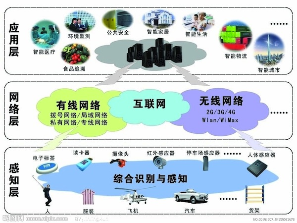

基本应用模式根据其实质用途可以归结为三种基本应用模式：

* **对象的智能标签**
通过二维码，RFID等技术标识特定的对象，用于区分对象个体，例如在生活中我们使用的各种智能卡，条码标签的基本用途就是用来获得对象的识别信息；此外通过智能标签还可以用于获得对象物品所包含的扩展信息，例如智能卡上的金额余额，二维码中所包含的网址和名称等。 　　
* **环境监控和对象跟踪**
利用多种类型的传感器和分布广泛的传感器网络，可以实现对某个对象的实时状态的获取和特定对象行为的监控，如使用分布在市区的各个噪音探头监测噪声污染，通过二氧化碳传感器监控大气中二氧化碳的浓度，通过GPS标签跟踪车辆位置，通过交通路口的摄像头捕捉实时交通流程等。 　　
* **对象的智能控制**
物联网基于云计算平台和智能网络，可以依据传感器网络用获取的数据进行决策，改变对象的行为进行控制和反馈。例如根据光线的强弱调整路灯的亮度，根据车辆的流量自动调整红绿灯间隔等。

随着物联网产业链的成熟，物联网技术已应用于智能家居、智能医疗、智能城市、智能环保、智能交通等领域。教育是物联网的主要应用行业之一，物联网技术对移动学习的影响主要体现在以下几个方面：

* 以物联网为基础构建智能化的学习环境，例如，通过智能标签标记学习对象实体和位置。
* 建立全面主动的教学管理体系。通过物联网可完成对于教学环境的监控和学生个体的跟踪，不仅在数字化校园和校园安全管理等方面有重要的作用，而且对个体学习活动的跟踪也有利于提供主动的教学服务。
* 教学模式的重构和创新。物联网为学习内容革新和实践学习活动的组织提供了技术基础，丰富了课外活动的内容，拓展了课外活动的范围。

目前，物联网的一些技术已经应用于移动学习中，例如，结合RFID标签，我们可以提供学习内容的定向推送，学习者位置的跟踪和管理。我们已经能够预知道它未来无可限量的应用，但要在现阶段广泛应用于教育实际，仍有许多问题亟待解决。例如，基础设施的建设，规模化，安全性，成本问题，模式创新的问题。
          
###增强现实技术（AR）
增强现实（Augmented Reality，简称AR），也被称之为混合现实。它通过电脑技术，将虚拟的信息应用到真实世界，真实的环境和虚拟的物体实时地叠加到了同一个画面或空间同时存在。增强现实提供了在一般情况下，不同于人类可以感知的信息。它不仅展现了真实世界的信息,而且将虚拟的信息同时显示出来，两种信息相互补充、叠加。在视觉化的增强现实中，用户利用头盔显示器，把真实世界与电脑图形多重合成在一起，便可以看到真实的世界围绕着它。

增强现实借助计算机图形技术和可视化技术产生现实环境中不存在的虚拟对象，并通过传感技术将虚拟对象准确“放置”在真实环境中，借助显示设备将虚拟对象与真实环境融为一体，并呈现给使用者一个感官效果真实的新环境。因此增强现实系统具有虚实结合、实时交互、三维注册的新特点。

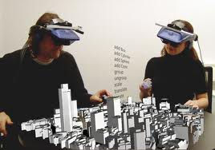
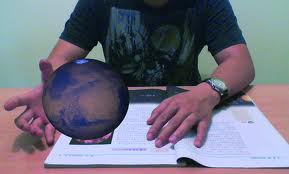

AR技术可用于数据模型的可视化、虚拟训练、娱乐与艺术等领域具有广泛的应用，增强现实在移动学习中的应用领域主要有：

* **多媒体信息呈现** 由于增强现实技术具有能够对真实环境进行增强显示输出的特性，在医疗研究与解剖训练、精密仪器制造和维修、工程设计等学科内容的学习，通过手持设备在现场学习，具有比虚拟现实技术更加明显的优势。
* **即时信息** 旅行者和学生可以使用AR系统结合地点或智能标签了解有关特定历史事件的更多信息。例如，在某个历史建筑中，可以通过在头戴式增强现实显示器上将历史事件显示在现实的位置上。它将使您沉浸在历史事件中，有身临其境之感，而且视角将是全景的。
* **参与体验** 可以将学习内容映射到周围的真实世界中，使得学习者成为其中的一个角色。澳大利亚的一位研究人员创作了一个将流行的视频游戏Quake和增强现实结合起来的原型游戏。他将一个大学校园的模型放进了游戏软件中。现在，如果他使用该系统，那么在他绕着校园行走时，就会处于该游戏场景中。

增强现实技术令人振奋，目前已经有一些出色的AR软件开始登陆手机和平板电脑平台，比较典型的应用有Layar等。但是增强现实对于设备、环境的要求较高，现阶段开发成本非常高，因此广泛推广还有待该项技术进一步发展。

##7.2 移动学习会提供更自然的学习体验

###未来的移动学习技术
在将来的5-10年内，移动技术将有更大的飞跃。首先是通信带宽的不断提速，无线宽带网将超过现在的有线宽带连接，各类的数据交流和共享将突破现有的瓶颈；然后是移动设备配备的传感器种类也不断增加，嗅觉、视觉、听觉、触觉等传感器将成为配置选项；而且，移动设备的能力也在不断扩展，具有监测、传输、释放气味、光、发热等能力。根据目前研究的紧张，可用于移动学习和泛在学习的技术可能会有：

####可穿戴的计算机
穿戴计算机是一种能时刻伴随使用者的计算机，它解放了人的双手，在对计算机操作时不影响双手做其他工作，具备移动性和感知能力，具有无线组网能力，可保持连续工作状态，而且具有十分友好的人机交互能力。加拿大传媒学家麦克卢汉在上个世纪60年代就提出了“媒介是人的延伸”，今天的可穿戴计算机正在实现着人各个器官的功能，并延长着每一个功能。

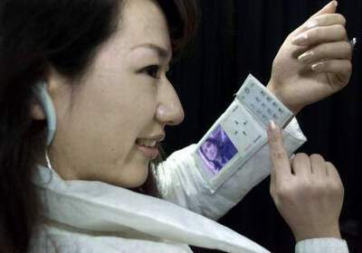

美国麻省理工学院媒体实验室的研究人员研发出的可穿戴计算机系统可以把任何表面转换成一个交互显示屏。佩带该系统的人可以随意利用虚拟装置，收集网络数据。这项研究的目的是为人类创造一种新型数字“第六感”。谷歌的Project Glass可穿戴式眼镜计算机，该款眼镜可将信息传送至镜片，并且允许穿戴用户通过声音控制收发信息。该眼镜还有一款内置摄像头，可以进行视频录制及照片拍摄。该款眼镜是谷歌首次尝试可穿戴式计算机产品研发的结果。在国内，哈尔滨工业大学可穿戴计算机工程研究中心也研制出了中国的可穿戴计算机样机。

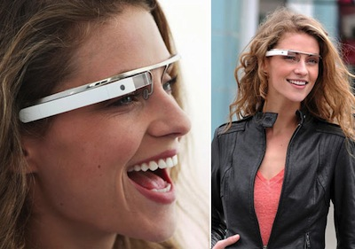

可穿戴机虽然看起来是穿戴在人体上的计算机，但并不能仅仅理解为将计算机穿在身上，在可穿戴计算工程中有11项关键技术，如无线自组网、无线通讯、嵌入式操作系统、人机交互技术等都是当前计算机科学的难关。可穿戴计算机将可能与新一代移动通信设备（如手机）相结合，从而满足新的应用。 

####立体化的手势
基于触摸屏的的手势使人机交互变得更加自然直观，更为人性化。比如iPad、iPhone和一些采用Windows Mobile，Android等系统的手机即平板电脑已经让用户体验到触控的便利。但是这种触控技术仍旧局限于一个平面内，需要通过触摸屏的配合才能使用。在此基础上，科学家又研究出了更为先进的手势交互方式。

例如，MIT的第六感项目，演示人员在四根手指上分别戴着红、蓝、绿和黄四种颜色的神奇标志物(Magic Marker)，帮助摄像头区别四根手指，并通过特制的软件辨认手势。例如，需要打开照相机功能时，只要利用拇指和食指组成一个画框，照相机就知道该拍摄照片了，而且照好的照片将被保存在手机里。需要查看时间时，用右手指在左手臂上画了一个圆圈，一个表面出现在他的手上。需要阅读电子邮件时，只需用手指在空中画一个@符号。他可以在手掌上显示一个手机按键，无需从衣袋中拿出手机，就能拨号。

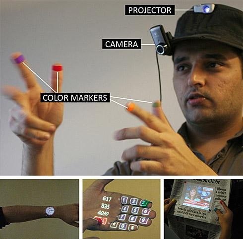

####利用脑电波操作

利用脑电波操纵是一种新的人机交互方式，它使用某些特殊的装置设备，直接通过脑电波来操纵特定的仪器、设备；只需要你脑子里头念头一动，机械或设备就已经按照你的想法去运转。脑波操控的原理是：使用者头戴一个类似于做脑电图时戴的帽子，其实质是里头有很多电极，能对使用者的脑电波进行测量；同时有一台计算机，对于电极传送回来的使用者的脑电波的变化加以分析，判断出使用者究竟发出了什么指令，再按照预设的程序，操纵机械设备进行相应的活动。

目前脑波操控在实验室中已经实现。日本的理化学研究所与丰田汽车等共同开发出了通过想象移动“脚”、“左手”、“右手”使电动轮椅“前行”、“左转”及“右转”的系统控制基础技术。其原理是，首先测量用户想象三个动作时的脑电波，并识别为三种不同的命令，然后使轮椅移动。由脑电波控制的可靠度达95％以上。另外，轮椅操作者绷紧面部（测量的是肌电位而非脑电波）肌肉时，便可使轮椅停止动作。

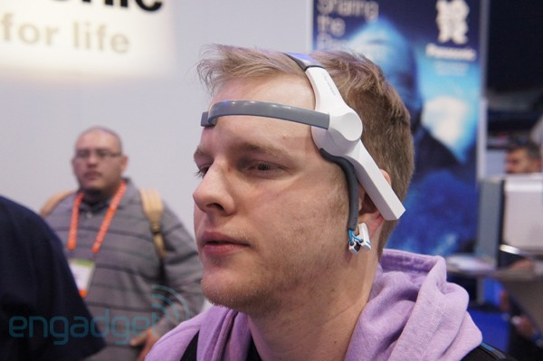

##7.3 未来学习方式的变化

未来的学习者具有更好的信息技术素养，他们是信息时代的原住民。因此更加自我导向，更加熟练地获取和利用信息，更倾向于合作，更愿意参与社会互动。学习者不仅是学习内容的消费者，也是学习内容的创造者。

英国普利茅斯大学的教育学院的Steve Wheeler教授认为，未来的学习是开放的，社会化和个性化的。互联网的出现推动了信息架构的变化，而移动互联网更是另一次伟大的革新。Web1.0的特征是信息间的联结，Web2.0将人联系在一起，而Web3.0让语义网络得以实现，将知识联结。新技术的出现推动了学习范式革新，在学习内容、教学模式、评价反馈模式，以及师生关系方面都会发生巨大的变化。未来的学习具有以下的一些特征：

####1. 开放
人类社会进步要求人人都有终身接受教育的权利，这种开放教育要求：教育对象的开放；教育观念开放；教育资源开放；教育过程开放。开放教育要求以学生和学习为中心，而不是以教师、学校和教学为中心；采用各种教和学的方法手段；取消和突破各种对学习的限制和障碍；学生对课程选择和媒体使用有一定的自主权，在学习方式、学习进度、时间和地点等方面也可由学生根据需要决定；在教学上采用多种媒体教材和现代信息技术手段等等。

####2. 泛在
泛在学习是移动的学习的高级阶段，其目标就是创造让学生随时随地、利用任何终端进行学习的教育环境，实现更有效的学生中心教育。在泛在学习环境中，学生根据各自的需要在多样的空间、以多样的方式进行学习，即所有的实际空间成为学习的空间。学习者能一直保持在学习状态除非自己取消学习要求，并且学习过程是连续的、无缝的。学习者不管在哪里，都可以直接从服务器或是从对等网络中获取信息，同时学习者可以通过同步或异步的方式与其他学习者讨论交流，实现信息交互、学习互动。

####3. 混合
为实现教学目标采用不同学习方式的混搭，例如在线学习和面授相结合的学习方式相结合。这种混合既可以是不同学习技术的搭配使用，更重要的是不同教学范式的结合，以充分发挥各种模式的长处，以达到降低成本，提高效益的一种教学方式。目前刚刚流行起来的“翻转课堂”就是一种混合模式，将在线学习和面授讨论相结合。在翻转课堂上，学生在家观看课程所需讲座和补充材料(通常是他们的教师预先录制，并上传到网络)；课堂时间用于回答学生提出的问题，帮助他们完成习题作业，以及开展其他活动来帮助学生应用他们已经学到的东西。 

####4. 个别化
基于个人的，能够理解认得需求和已有知识。学习技术的发展使得个别化学习不仅仅停留在价值观和理论层面。技术的应用是个别化学习的物质保障。通过对个人学习档案的分析，个人学习过程的跟踪，学习内容的个性化设计，可针对个人的特征，个人的学习需求提供学习服务。个人也可建立自己的个性化学习环境。

####5. 社会化
受互联网的影响，未来的学习是社会化的学习。社会化学习的核心是关系、是互动、是连结。社会化学习利用社交网络媒体进行学习，利用社交网络媒体的一些理念来学习，比如交互、分享、共享、群体效应、用户中心。事实上许多教授开始使用社群媒体作为一种连接学生、引发讨论和讯息传递的重要媒介。随着多数大学生能够从他们的手机或其他移动设备进入社群网站，无论他们多麽繁忙或无论他们在哪裡，学生们没有理由不参与在社群网站上的课程讨论。虽然社群网站在教育裡仍有争议，随着Twitter和Facebook网站的发展，社群网站渐能提供学生更加完善和更强大的教育经验。

####6. 微型化
学习者的有效注意力很短。教育者正在发展提供5分钟左右的微型课程。这些小量的学习使学生每一次只接触少量的新内容，更容易吸收和理解。移动设备是微型学习的最佳载体，学习内容可随身携带或随时获得，让学习者利用时间片段进行短时间的学习，在排队等候、坐车或在沙发小憩都可以让学习得以发生。

###总结
学习范式的改变既是结果又是原因。以上的这些改变是新学习技术应用的必然结果，其又会进一步影响到下一轮的学习技术的发展。作为教育行业的专业人员，我们既不能迷信技术能够解决一切问题，也需要拥抱变革，尝试用各种新技术来促进学习。

##参考文献
1. http://www.cloudcomputing-china.cn/Article/jh/200805/1.html
2. http://www.hudong.com/wiki/物联网
3. http://zh.wikipedia.org/wiki/電子書
4. 方海光,刘泮,黄荣怀.面向电子书的移动学习系统环境应用及趋势研究[J].现代教育技术.2011/12
5. 云计算对移动学习的影响 http://www.jifang360.com/news/2011925/n994929390.html
6. 李婷.接合自然 增强现实——移动学习新体验[J].中国远程教育.2011(08)
7. Steve Wheeler. New technologies and the future of learning[EB/OL]. http://www.slideshare.net/timbuckteeth/new-technologies-and-the-future-of-learning

